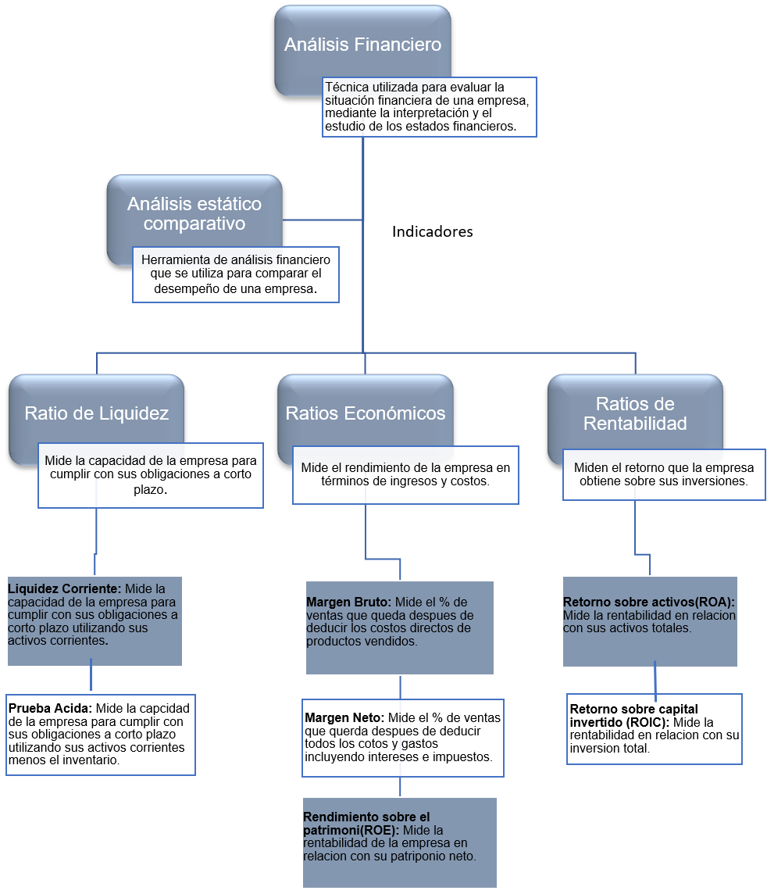

```{r setup, include = FALSE}
setwd("C:/Users/oienh/Documents/R_UNIVERSITY_PROJECTS/5th_Semester/trabajo_finanzas")
knitr::opts_chunk$set(echo = FALSE, comment = NA)
```

```{r, echo=FALSE, fig.align = "left"}
knitr::include_graphics("logo.png")
```
\center

# Trabajo Grupal Finanzas I -- Amazon (AMZN)
## 2023-04-02

\flushleft
```{r, echo=FALSE, fig.align = "center"}
knitr::include_graphics("coat_of_arms.png")
```

* Amanda Araya Orrego
* Lucas Oliva Valverde
* Melissa Sumi Ibata
* Exequiel Valdés Zúñiga

\newpage

```{r, include=FALSE}
formato <- function(x) {
    format(round(x, 2), big.mark = " ", scientific = FALSE,
    decimal.mark = ",")
}
# Formato para añadir separadores de miles, coma decimal, y
# dos puntos decimales.
```

*En este documento se hará uso de los prefijos del sistema internacional
de unidades (k = × 1 000; M = × 1 000 000; G = × 1 000 000 000)
para la representación de cantidades de dinero.*
[Hipervínculo Wikipedia.](https://en.wikipedia.org/wiki/Metric_prefix)


# Introducción

En el presente informe, se hará un análisis financiero que integrará los siguientes
aspectos: análisis estático comparativo, que compara los dos últimos balances del año
2021 al 2022 de la empresa con información proporcionada por la plataforma
Investing.com, con el objetivo de determinar porcentualmente el peso relativo de las
partidas. Las herramientas que se utilizaran son los ratios financieros, tales como liquidez,
rentabilidad, endeudamiento, entre otros los cuales establecen la relación entre una
variable y otra comportándose como un índice que se utiliza para evaluar el desempeño
de la empresa, cabe destacar que esta interpretación dependerá del tipo rubro de cada
empresa y la actividad que realice.
La empresa seleccionada es Amazon.com, la cual es reconocida mundialmente por ser uno
de los lideres en comercialización de productos y servicios, entre los principales son el
comercio en línea, transmisión digital, publicidad en línea, entre otros. En los últimos
años, Amazon ha experimentado crecimientos significativos en distantes áreas a nivel
global, todo gracias a que es una empresa altamente desarrollada que ha liderado en
varios campos claves de la tecnología.

# Marco Conceptual

```{r, echo=FALSE, fig.align = "center"}

```

```{r}
library(readxl)

estado_de_resultado <- read_excel(
    "estado_de_resultados.xlsx",  range = "A1:C35")
balance <- read_excel("balance.xlsx",  range = "A1:C49")
estado_de_resultado <- estado_de_resultado[-1, ]
balance <- balance[-1, ]
# Se extrajo los datos de los archivos. Fuente: "investing.com".
```

# Capital Trabajo Neto

```{r}
capital_trabajo_neto_2022 <- as.numeric(balance[1,
    2]) - as.numeric(balance[21, 2])
capital_trabajo_neto_2021 <- as.numeric(balance[1,
    3]) - as.numeric(balance[21, 3])
# Fórmula: capital trabajo neto = activos corrientes - pasivos corrientes.

cat("El capital de trabajo neto fue de USD",
    formato(capital_trabajo_neto_2021),
    "M en el año 2021.\nMientras que en 2022 fue de USD",
    formato(capital_trabajo_neto_2022), "M.\nLa diferencia es de USD",
    formato(capital_trabajo_neto_2022 - capital_trabajo_neto_2021), "M.")
```

# Ratios de Liquidez

## Liquidez

```{r}
liquidez_2022 <- as.numeric(balance[1, 2]) / as.numeric(balance[21, 2])
liquidez_2021 <- as.numeric(balance[1, 3]) / as.numeric(balance[21, 3])
# Fórmula: liquidez = activos corrientes / pasivos corrientes.

cat("La liquidez del año 2021 fue de",
    formato(liquidez_2021),
    ".\nMientras que en el año 2022 fue de",
    formato(liquidez_2022), ".\nLa diferencia es de",
    formato(liquidez_2022 - liquidez_2021), ".")
```
Este indicador nos mostrara que por cada peso o más bien dólar en el caso de esta empresa
cuyas finanzas están en millones de dólares, que debe la empresa a corto plazo tiene cierta
cantidad de dólares para respaldar dichas obligaciones. Como se puede observar en los comandos
realizados, la razón de liquidez de la empresa se redujo de 1,14 en el año 2021 a 0,94 en el
año 2022, lo que se traduce en una disminución del 19% de un año al otro. Dado que no tenemos
los datos de la industria en general, no podemos saber si esta disminución se debe a un problema
con el mercado en general o un problema en particular con la empresa de Amazon, si bien que el
indicador sea superior a uno no significa un cumplimiento con las obligaciones, el indicador
bajo hasta el punto donde ni siquiera es 1, por lo que esto es un signo bastante negativo para
una empresa tan grande como Amazon. 

## Liquidez Inmediata

```{r}
liquidez_inmediata_2022 <- as.numeric(balance[4, 2]) / as.numeric(balance[21, 2])
liquidez_inmediata_2021 <- as.numeric(balance[4, 3]) / as.numeric(balance[21, 3])
# Fórmula: liquidez inmediata = efectivo y equivalente / pasivos corrientes.

cat("La liquidez inmediata del año 2021 fue de",
    formato(liquidez_inmediata_2021),
    ".\nMientras que en el año 2022 fue de",
    formato(liquidez_inmediata_2022), ".\nLa diferencia es de",
    formato(liquidez_inmediata_2022 - liquidez_inmediata_2021), ".")
```
El caso más pesimista para una crisis donde para cumplir con las obligaciones a corto plazo,
solo se tomarán en cuenta el dinero en efectivo o equivalentes que posea la empresa para poder
cumplir con estas. Sorpresivamente hubo un aumento en este indicador del año 2021 con un 0,25
al año 2022 con un 0,35, es decir, un aumento del 9%. Esto significa un aumento en las cuentas
de efectivo y equivalentes, que, si bien siguen estando lejos de lo deseado, no podemos decir
que sea algo negativo o positivo al no tener los datos de la industria para poder compararlos.

## Prueba Ácida

```{r}
prueba_acida_2022 <- (as.numeric(balance[1,
    2]) - as.numeric(balance[8, 2])) / as.numeric(balance[21, 2])
prueba_acida_2021 <- (as.numeric(balance[1,
    3]) - as.numeric(balance[8, 3])) / as.numeric(balance[21, 3])
# Fórmula: prueba ácida = (activos corrientes - inventario) / pasivos corrientes.

cat("La prueba ácida del año 2021 fue de",
    formato(prueba_acida_2021),
    ".\nMientras que en el año 2022 fue de",
    formato(prueba_acida_2022), ".\nLa diferencia es de",
    formato(prueba_acida_2022 - prueba_acida_2021), ".")
```
Este indicador nos mostrara que por cada dólar que debe la empresa a corto plazo tiene
cierto promedio de dólares para su pago, pero en este caso solo en activos corrientes que sean
más líquidos sin tener que acudir a la venta de su inventario. Al observar el resultado de los
comandos usados, se puede observar que comparando el indicador de liquidez y el de prueba acida,
el inventario no es tan prominente como se cabría esperar de una empresa como Amazon, dado que
el indicador en el año 2021 es de 0,91 y en el año 2022 es de 0,72, traduciéndose en una
disminución del 18%. Aunque es verdad que sin el inventario la empresa no podría cumplir con
sus obligaciones en el año 2021 y mucho menos en el año 2022.

# Solvencia

```{r}
solvencia_2022 <- as.numeric(balance[11, 2]) / as.numeric(balance[28, 2])
solvencia_2021 <- as.numeric(balance[11, 3]) / as.numeric(balance[28, 3])
# Fórmula: solvencia = activos total / pasivos total.

cat("La solvenncia del año 2021 fue de",
    formato(solvencia_2021),
    ".\nMientras que en el año 2022 fue de",
    formato(solvencia_2022), ".\nLa diferencia es de",
    formato(solvencia_2022 - solvencia_2021), ".")
```
El indicador de solvencia nos muestra la capacidad que tiene una empresa de poder cumplir
con sus obligaciones a corto y largo plazo. En el caso de Amazon, según los comandos utilizados,
la solvencia del año 2021 fue de 1,49, mientras que en el año 2022 fue de unos 1,46. Hubo una
reducción de un 3% en la solvencia de la empresa a lo largo de un año, sin embargo, sigue
estando en un rango aceptable en términos generales. No se puede decir nuevamente si esto es
algo bueno o malo, ya que no se están analizando los datos de la industria, pero se puede decir
que la empresa si cumple con sus obligaciones en el corto y largo plazo. 

# Endeudamiento

```{r}
endeudamiento_2022 <- as.numeric(balance[28, 2]) / as.numeric(balance[35, 2])
endeudamiento_2021 <- as.numeric(balance[28, 3]) / as.numeric(balance[35, 3])
# Fórmula: endeudamiento = pasivos total / patrimonio.

cat("El endeudamiento del año 2021 fue de",
    formato(endeudamiento_2021),
    ".\nMientras que en el año 2022 fue de",
    formato(endeudamiento_2022), ".\nLa diferencia es de",
    formato(endeudamiento_2022 - endeudamiento_2021), ".")
```

# Ratios Económicos

## Margen Bruto
```{r}
margen_bruto_2022 <- as.numeric(estado_de_resultado[5,
    2]) / as.numeric(estado_de_resultado[1, 2])

margen_bruto_2021 <- as.numeric(estado_de_resultado[5,
    3]) / as.numeric(estado_de_resultado[1, 3])

# Utilidad bruta / Ingresos

cat("El margen bruto del año 2021 fue de",
    formato(margen_bruto_2021 * 100),
    "%.\nMientras que en el año 2022 fue de",
    formato(margen_bruto_2022 * 100),
    "%.\nLa diferencia es de",
    formato(margen_bruto_2022 * 100 - margen_bruto_2021 * 100),
    "%.")
```
## Margen Operacional

```{r}

margen_operacional_2022 <- as.numeric(estado_de_resultado[13,
    2]) / as.numeric(estado_de_resultado[1, 2])

margen_operacional_2021 <- as.numeric(estado_de_resultado[13,
    3]) / as.numeric(estado_de_resultado[1, 3])

# Utilidad de operación / Ingreso

cat("El margen operacional del año 2021 fue de",
    formato(margen_operacional_2021 * 100),
    "%.\nMientras que en el año 2022 fue de",
    formato(margen_operacional_2022 * 100),
    "%.\nLa diferencia es de",
    formato(margen_operacional_2022 * 100 - margen_operacional_2021 * 100),
    "%.")

```
## Margen Neto

```{r}
margen_neto_2022 <- as.numeric(estado_de_resultado[25,
    2]) / as.numeric(estado_de_resultado[1, 2])

margen_neto_2021 <- as.numeric(estado_de_resultado[25,
    3]) / as.numeric(estado_de_resultado[1, 3])

# Resultado neto / Ingreso

cat("El margen neto del año 2021 fue de",
    formato(margen_neto_2021 * 100),
    "%.\nMientras que en el año 2022 fue de",
    formato(margen_neto_2022 * 100),
    "%.\nLa diferencia es de",
    formato(margen_neto_2022 * 100 - margen_neto_2021 * 100), "%.")

```

## ROE (Rendimiento Sobre el Patrimonio)


# Ratios de Rentabilidad

## ROA (Ratio de Capital Propio)

```{r}
roa_2022 <- as.numeric(estado_de_resultado[25,
    2]) / as.numeric(balance[11, 2])
roa_2021 <- as.numeric(estado_de_resultado[25,
    3]) / as.numeric(balance[11, 3])
# Fórmula: ROA = resultado neto / activo total * 100

cat("El ROA fue de",
    formato(roa_2021 * 100),
    "% en el año 2021.\nMientras que en 2022 fue de",
    formato(roa_2022 * 100), "%.\nLa diferencia es de USD",
    formato((roa_2022 - roa_2021) * 100), "%.")
```

## ROI (Ratio de Rentabilidad de Ventas)

```{r}
roi_2022 <- as.numeric(estado_de_resultado[25,
    2]) / as.numeric(balance[35, 2])
roi_2021 <- as.numeric(estado_de_resultado[25,
    3]) / as.numeric(balance[35, 3])
# Fórmula: roi = resultado neto / patrimonio * 100

cat("El ROI fue de",
    formato(roi_2021 * 100),
    "% en el año 2021.\nMientras que en 2022 fue de",
    formato(roi_2022 * 100), "%.\nLa diferencia es de",
    formato((roi_2022 - roi_2021) * 100), "%.")
```

## ROIC (Retorno Sobre Capital Invertido)

